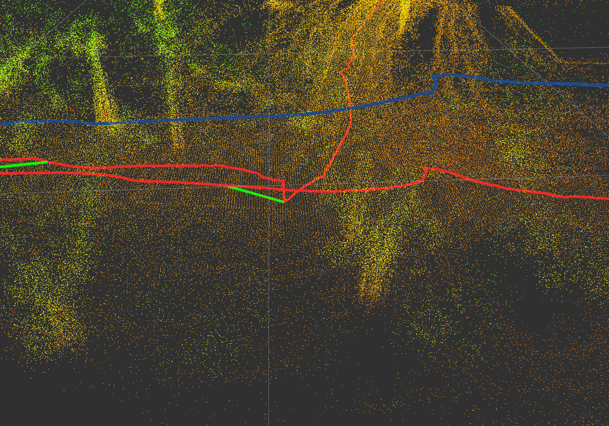

# LAB_SLAM

This lab_slam is an exercise for me, both in SLAM theory and programing skills, thus it may be naive for some experts.

Currently, it completed a lidar odometry, loop clousre detecion based on pose, and pose graph optimization after a clousre is found successfully.


In the above picture, the blue line shows the pose path of purely scan-to-scan matching odometry, and comparatively the red one means the result after scan-to-map matching refinement, which is obviously better.



A loop clousre is indicated by a green line, which links the current pose with a historical one, and the the pose graph is optimized using gtsam, leading to a jump of current scan-to-map pose path(in red).

Please refer to /img directory for more demos.

## Dependency

- ROS(tested with ROS melodic 1.14.10)
- Eigen(tested with eigen-3.2.10)
- PCL(tested with pcl-1.8)
- Glog
- GTSAM(tested with gtsam-4.0.2)
- Ceres(tested with ceres-1.14.0)
- #OpenCV(just for visualization)

## Compile

```
cd ~/catkin_ws/src
git clone git@github.com:TongxingJin/lab_slam.git
cd ..
catkin_make
```

## Usage

```
source devel/setup.bash
roslaunch lab_slam run.launch
```

## Test Data

I use [rosbag data](https://drive.google.com/file/d/1je-h8YzAfn_aDiTcL4NAw8rKohvvMOcN/view?usp=sharing) provided in LIO-SAM to debug this lab_slam.

It's also avaliable from Baidu Netdisk at:<br/>
link:https://pan.baidu.com/s/1MqQD22d4sA3iUszlWg3C8Q password:2eyj<br/>